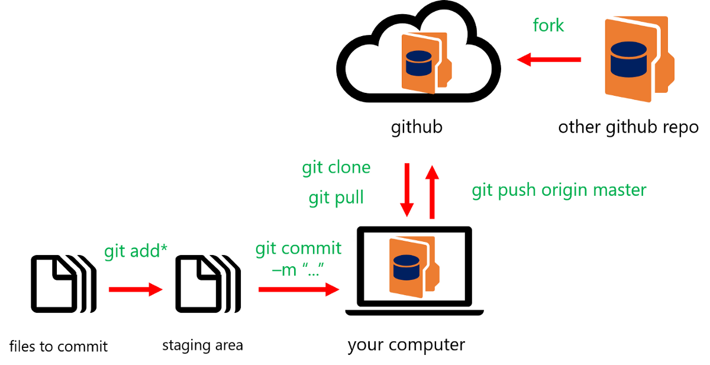
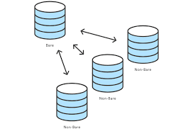
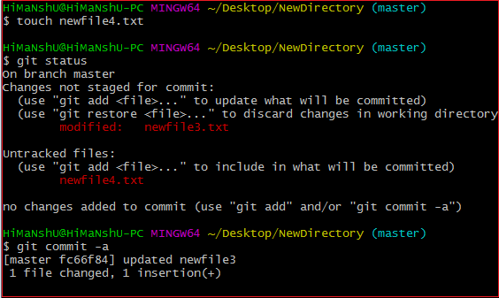

<!-- _backgroundColor: aquq -->

<!-- _color: blue -->

<!-- paginate: false -->

## Algorithms And Programming

### Week-2 (Git)

#### Spring Semester, 2022-2023

Download [DOC](week-2.en.md_doc.pdf), [SLIDE](week-2.en.md_slide.pdf), [PPTX](week-2.en.md_slide.pptx)

<iframe width=700, height=500 frameBorder=0 src="../week-2.en.md_slide.html"></iframe>

---

<!-- paginate: true -->

### Git

- How to use Git?

---

## **How to use Git?**

---

### Git

- **Here is a basic overview of how Git works**
1.Create a "repository" (project) with a git hosting tool (like Bitbucket)
2.Copy (or clone) the repository to your local machine
3.Add a file to your local repo and "commit" (save) the changes
4."Push" your changes to your main branch
5.Make a change to your file with a git hosting tool and commit
6."Pull" the changes to your local machine
7.Create a "branch" (version), make a change, commit the change
8.Open a "pull request" (propose changes to the main branch)
9."Merge" your branch to the main branch

---

### Git

- **Sample git notation**
A simple modeled version of the git shown in this image.

---

### Git

- **Simple "git init" notation**

The git init command creates a new Git repository. It can be used to convert an existing, unversioned project to a Git repository or initialize a new, empty repository.

---

### Git

- **How to use "git add"**
Here you see using a git add from the command line.

---

### Git

- **How to use "git commit"**
Here you see using a git commit from the command line.

---

**TODO** DO MORE LEARN

--- 

## References

- https://www.atlassian.com/git/tutorials/learn-git-with-bitbucket-cloud
- https://www.atlassian.com/git/tutorials/setting-up-a-repository/git-init
- https://www.atlassian.com/git/tutorials/learn-git-with-bitbucket-cloud
- https://medium.com/swlh/an-introduction-to-git-and-github-22ecb4cb1256
- https://git-scm.com/

---

$End-Of-Week-2-Module$
