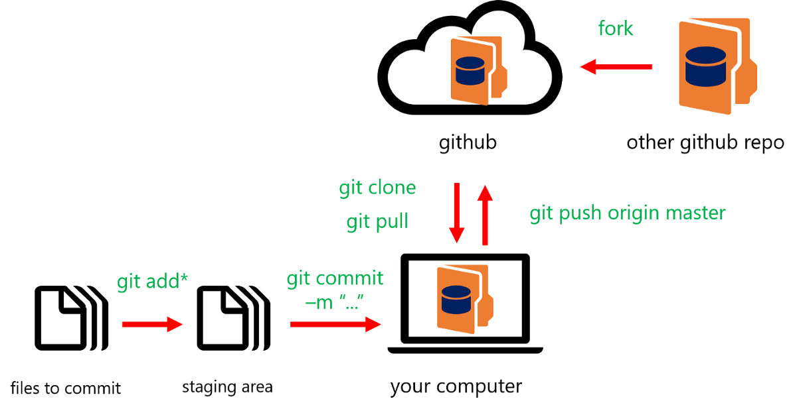
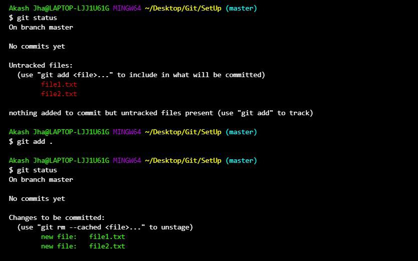
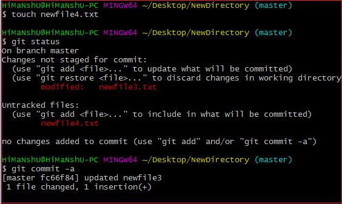

<!-- _backgroundColor: aquq -->

<!-- _color: blue -->

<!-- paginate: false -->

## Algorithms And Programming

### Hafta-2 (Git)

#### Bahar Dönemi, 2022-2023

İndir [DOC](week-2.tr.md_doc.pdf), [SLIDE](week-2.tr.md_slide.pdf), [PPTX](week-2.tr.md_slide.pptx)

<iframe width=700, height=500 frameBorder=0 src="../week-2.tr.md_slide.html"></iframe>

---

<!-- paginate: true -->

### Git

- Git Nasıl Kullanılır?
---

## **Git Nasıl Kullanılır?**

---

### Git

- **Git'in nasıl çalıştığına dair temel bir bakış**
1. Git komut aracıyla (Bitbucket gibi) bir "depo" (proje) oluşturun
2. Depoyu yerel makinenize kopyalayın (veya klonlayın)
3. Yerel deponuza bir dosya ekleyin ve değişiklikleri "taahhüt edin" (kaydedin)
4. Değişikliklerinizi ana merkeze "gönderin"
5. Git komut aracıyla dosyanızda değişiklik yapın ve taahhütte bulunun
6. Değişiklikleri yerel makinenize "çek"
7. Bir "dal" (sürüm) oluşturun, değişiklik yapın, değişikliği taahhüt edin
8. Bir "çekme isteği" açın (ana dalda değişiklik önerin)
9. Şubenizi ana şubeyle "birleştirin"
---

### Git

- **Örnek git gösterimi**
Bu resimde gösterilen git'in basit bir modellenmiş versiyonu.

---

### Git

- **Basit "git init" gösterimi**

git init komutu, yeni bir Git deposu oluşturur. Var olan, sürümlendirilmemiş bir projeyi Git deposuna dönüştürmek veya yeni, boş bir depo başlatmak için kullanılabilir.

---

### Git

- **"git add" nasıl kullanılır**
Burada komut satırından bir git add kullanmayı görüyorsunuz.

---

### Git

- **"git commit" nasıl kullanılır**
Burada komut satırından bir git commit kullandığını görüyorsunuz.

---

**YAPILACAKLAR** DAHA ÇOK ÖĞRENİN!

--- 

## Referanslar

- https://www.atlassian.com/git/tutorials/learn-git-with-bitbucket-cloud
- https://www.atlassian.com/git/tutorials/setting-up-a-repository/git-init
- https://www.atlassian.com/git/tutorials/learn-git-with-bitbucket-cloud
- https://medium.com/swlh/an-introduction-to-git-and-github-22ecb4cb1256
- https://git-scm.com/

---

$Hafta-2-Son$
